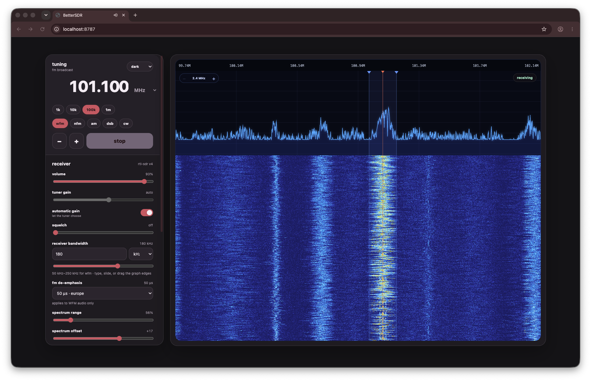

# BetterSDR



BetterSDR is a friendly, local browser receiver for the RTL-SDR Blog V4. A small Express server controls `rtl_sdr`, processes its raw I/Q stream, sends live RF spectrum and audio over a WebSocket, and serves the complete interface from one HTML file.

The current release is designed and tested for one RTL-SDR Blog V4 connected directly to a Mac.

> [!IMPORTANT]
> **Tuning range is not simultaneous bandwidth.** The V4 can retune across BetterSDR's supported 100 kHz–1.766 GHz range, but one dongle delivers only one 2.4 MHz-wide RF capture at a time. Private listeners can independently tune anywhere inside that live slice. Retuning the physical dongle outside it would replace the slice for every listener, so BetterSDR allows a full-range retune only when one listening session is active. Simultaneous listeners on widely separated frequencies require additional RTL-SDR dongles.

## Features

- Browser-controlled tuning from 100 kHz to 1.766 GHz
- Light and dark interface themes
- Explicit Hz, kHz, MHz, and GHz frequency entry
- WFM, NFM, AM, DSB, and basic CW reception
- Automatic or manual tuner gain
- Squelch and PPM frequency correction
- Direct-sampling and bias-tee controls
- Tuning steps and keyboard tuning
- Low-latency 48 kHz browser audio
- Private per-browser VFO, mode, bandwidth, squelch, audio, start/stop, and recording sessions
- Two simultaneous listeners by default inside one shared 2.4 MHz hardware capture
- Real 2.4 MHz RF spectrum and waterfall
- 100 kHz–2.4 MHz display zoom, mouse-wheel zoom, and click-to-tune
- Smooth click-and-drag tuning with an in-window digital VFO
- Exact custom receiver bandwidth in Hz or kHz, with broad mode-aware safety limits
- Draggable channel-filter edges on the spectrum
- Selectable off, 50 µs, or 75 µs WFM de-emphasis
- Adjustable spectrum range, spectrum offset, and waterfall color sensitivity
- Browser-only WAV recording with an immediate local download
- Settings saved in the browser
- Friendly receiver errors and one automatic recovery attempt

## How it works

```text
RTL-SDR Blog V4
        │ USB
        ▼
     rtl_sdr
        │ unsigned 8-bit I/Q at 2.4 MS/s
        ▼
Node DSP worker
        ├── RF FFT frames at about 18 FPS
        └── one private 48 kHz demodulator per active browser
                         │
                         ▼
Express + WebSocket server
        │ spectrum frames + audio
        ▼
Browser AudioWorklet
        ├── speaker audio
        ├── RF spectrum/waterfall
        └── receiver controls
```

1. `npm start` launches `server.js`.
2. Express serves `public/index.html` at `http://127.0.0.1:8787`.
3. The page connects back to the server at `/ws`.
4. Every WebSocket connection receives an isolated receiver session. Pressing **start** starts only that browser's session, and **stop** cannot stop another listener.
5. The first active session starts `rtl_sdr` at 2.4 MS/s around its hardware center frequency. The dongle stops only after the final active session ends.
6. A worker removes DC, creates shared FFT frames, and runs a separate digital VFO, demodulator, squelch, and 48 kHz audio path for every active browser.
7. The server sends each audio stream only to its owning browser. Active sessions share the RF spectrum because it represents the dongle's physical capture window.
8. The browser draws an absolute-frequency spectrum and waterfall from the FFT frames.
9. An AudioWorklet plays the demodulated audio, which can also be recorded as WAV.

With one active session, frequency changes outside the current safe RF window schedule one delayed hardware recenter after navigation settles. With multiple active sessions, every listener can tune independently inside the same 2.4 MHz capture, but the hardware center stays fixed so one visitor cannot interrupt the others. Gain, PPM, bias-tee, direct-sampling, and device changes are locked while multiple sessions are active because those settings physically belong to the dongle. Mode, receiver bandwidth, de-emphasis, squelch, volume, mute, start/stop, and recording remain private per browser.

One RTL-SDR cannot capture unrelated parts of its full tuning range simultaneously. Fully independent tuning outside a common 2.4 MHz window requires one dongle per hardware capture.

## Requirements

### Hardware

- RTL-SDR Blog V4
- A suitable antenna
- An available USB port or reliable powered USB hub

### Software

- macOS on Apple Silicon or Intel
- [Node.js](https://nodejs.org/en/download) 20 or newer; a currently supported LTS release is recommended
- npm, included with Node.js
- [Homebrew](https://brew.sh/)
- [Homebrew `librtlsdr`](https://formulae.brew.sh/formula/librtlsdr)
- A modern version of Safari, Chrome, Firefox, or Edge

BetterSDR has been verified with an RTL-SDR Blog V4/R828D, Homebrew `librtlsdr` 2.0.3, and macOS on Apple Silicon.

## Install on macOS

### 1. Install Node.js and Homebrew

Install a current Node.js release from [nodejs.org](https://nodejs.org/en/download) and Homebrew from [brew.sh](https://brew.sh/) if they are not already installed.

Confirm Node.js and npm are available:

```sh
node --version
npm --version
```

Node.js must report version 20 or newer.

### 2. Install the RTL-SDR tools

```sh
brew install librtlsdr
```

This installs the `rtl_sdr`, `rtl_biast`, `rtl_test`, and supporting RTL-SDR tools used by BetterSDR.

RTL-SDR Blog also maintains a [V4-focused driver fork](https://github.com/rtlsdrblog/rtl-sdr-blog) with additional tuner-specific changes. BetterSDR currently works with the Homebrew package above, which correctly detected the tested R828D V4.

### 3. Download BetterSDR

Clone or download this project, then open Terminal in its directory. For example, if the folder is named `bettersdr`:

```sh
cd /path/to/bettersdr
```

### 4. Install the project dependencies

```sh
npm install
```

This installs Express and the WebSocket library locally in `node_modules`.

### 5. Connect and verify the dongle

Close SDR++, GQRX, dump1090, and any other program that may be using the RTL-SDR. Only one process can own the dongle at a time.

Connect the V4 and run:

```sh
rtl_test -t
```

A successful V4 check includes output similar to:

```text
Found 1 device(s)
Found Rafael Micro R828D tuner
RTL-SDR Blog V4 Detected
```

Some `rtl_test` builds may print an E4000-related line after correctly detecting the R828D V4. The R828D and V4 detection lines are the important result for this check.

### 6. Start BetterSDR

```sh
npm start
```

The terminal should display:

```text
BetterSDR is ready at http://127.0.0.1:8787
```

Open [http://127.0.0.1:8787](http://127.0.0.1:8787) in a browser.

Stop BetterSDR at any time by returning to the terminal and pressing `Control-C`.

## First use

1. Connect an antenna appropriate for the frequency you want to receive.
2. Make sure SDR++ and other radio software are closed.
3. Open `http://127.0.0.1:8787`.
4. Type directly into the large frequency number. No dialog opens.
5. Choose Hz, kHz, MHz, or GHz beside it, then press **Enter**/**Done** or click away to tune. Press **Escape** to discard an edit.
6. Choose the appropriate mode.
7. Leave gain on **automatic** and squelch **off** while testing.
8. Press **start**.
9. Adjust browser volume as needed.

FM broadcast is a convenient first test. Tune a strong local station between 87.5 and 108 MHz and select **WFM**.

## Receiver controls

| Control | Purpose |
| --- | --- |
| Frequency | Type into the large number directly and choose its unit beside it. Enter, Done, or clicking away tunes; Escape cancels. |
| Tuning step | Sets how far the `−`, `+`, and arrow keys move the frequency. |
| Spectrum zoom | The graph’s `−` and `+` controls, or the mouse wheel, change the visible span from 100 kHz to 2.4 MHz. |
| Spectrum click | Clicking the RF graph moves the VFO immediately. It stays digital inside the captured window and recenters hardware only near an edge. |
| Spectrum drag | Drag horizontally across the graph to scrub smoothly through frequencies. The final position is sent after the pointer settles. |
| Receiver bandwidth | Selects how much RF around the tuned frequency is passed to the demodulator. Type an exact Hz/kHz value, use the slider, or drag either blue edge of the graph overlay. Each mode exposes the range its DSP path can process safely. |
| FM de-emphasis | Selects off, 50 µs for regions including Europe, or 75 µs for regions including the Americas. It applies only to WFM audio. |
| Spectrum range | Changes the vertical height used by the RF trace. Lower it when peaks are crowding the top. |
| Spectrum offset | Moves the RF trace up or down without changing receiver gain. |
| Waterfall sensitivity | Changes how quickly weak levels move from dark blue into cyan, white, yellow, and orange. It affects only the display colors. |
| WFM | Wide FM for commercial FM broadcast stations. |
| NFM | Narrow FM for two-way radio and amateur voice channels. |
| AM | Amplitude modulation, commonly used by aviation voice. |
| DSB | Coherent double-sideband reception for compatible AM-derived signals. |
| CW | Basic CW reception with a 700 Hz beat-frequency oscillator. Fine tuning may be necessary. |
| Volume | Changes audio in the current browser only. |
| Tuner gain | Uses automatic gain or a manual tuner-gain value. |
| Squelch | Mutes weaker signals. Start at zero/off. |
| PPM correction | Compensates for oscillator frequency error. |
| Direct sampling | Advanced input mode. Usually leave this off on a V4. |
| Bias tee | Supplies power through the antenna connector for compatible equipment. |
| Device | Chooses an RTL-SDR by index or serial number. The default is device `0`. |

Custom bandwidth limits reflect the intermediate sample rate used by each DSP path:

| Mode | Custom range | Default |
| --- | ---: | ---: |
| WFM | 50–250 kHz | 180 kHz |
| NFM | 1–60 kHz | 12.5 kHz |
| AM / DSB | 200 Hz–50 kHz | 10 kHz |
| CW | 50 Hz–10 kHz | 500 Hz |

## Recording

The recording button becomes available only after the receiver is playing.

Recordings are:

- Mono WAV files
- 48 kHz
- 16-bit PCM
- Collected only in the visitor's browser memory while recording
- Downloaded directly to that visitor's device when recording stops
- Named with the UTC timestamp and tuned frequency

BetterSDR does not upload or save new recordings on the server. Stopping that browser's private session finishes and downloads its active recording without affecting other listeners. Closing the page before stopping can discard the in-progress browser recording.

## Configuration

BetterSDR supports these environment variables:

| Variable | Default | Description |
| --- | --- | --- |
| `HOST` | `127.0.0.1` | Address used by the Express server. |
| `PORT` | `8787` | HTTP and WebSocket port. |
| `MAX_SESSIONS` | `2` | Maximum simultaneous private listener sessions, from 1 to 8. More sessions use substantially more DSP CPU. |
| `MAX_CONNECTIONS` | `16` | Maximum open browser/WebSocket connections, including stopped sessions. |
| `ALLOWED_ORIGINS` | empty | Optional comma-separated additional browser origins. Normal same-origin local and ngrok access is accepted automatically. |

Use a different local port if 8787 is occupied:

```sh
PORT=8788 npm start
```

Then open `http://127.0.0.1:8788`.

## Local-network access

Binding to every network interface is possible:

```sh
HOST=0.0.0.0 npm start
```

However, full LAN listening is **not supported securely yet**. BetterSDR’s low-latency player uses AudioWorklet, which browsers expose only in secure contexts. `localhost` and `127.0.0.1` are treated as trustworthy, while a plain address such as `http://192.168.1.20:8787` generally is not.

Browser sessions are isolated and WebSocket handshakes reject cross-origin browser pages. Remote visitors cannot change gain, PPM, bias tee, direct sampling, or device selection; those physical controls are available only from `localhost` on the receiver computer. The server still has no visitor login or built-in TLS certificate. Do not expose port 8787 directly to the public internet. Use an authenticated HTTPS tunnel before treating BetterSDR as a public remote receiver.

## Troubleshooting

### `rtl_sdr is not installed`

Confirm it is available:

```sh
command -v rtl_sdr
```

If nothing is returned:

```sh
brew install librtlsdr
```

Restart BetterSDR afterward.

### `No supported devices found`

- Disconnect and reconnect the dongle.
- Try a different USB port or powered hub.
- Run `rtl_test -t` outside BetterSDR.
- Confirm the device appears as an RTL-SDR Blog V4/R828D.

### `usb_claim_interface` or device-busy error

Another application owns the dongle. Close SDR++, GQRX, dump1090, other SDR tools, and any older BetterSDR server. Then try again.

Only one receiver process can use the same RTL-SDR at a time.

### The page opens but there is no audio

- Press **start**; loading the page does not start the dongle automatically.
- If another browser already started the receiver, tap or click once anywhere in the newly opened page so that browser can enable its own audio output.
- Make sure browser volume is above zero and BetterSDR is not muted.
- Set squelch to zero/off.
- Use **WFM** for commercial FM stations rather than NFM.
- Try a known strong local station.
- Check the antenna and connection.
- Confirm another application is not holding the dongle.
- Reload the page if the browser previously suspended audio.

### The signal is distorted or too noisy

- Confirm the selected modulation mode.
- Return tuner gain to **automatic**.
- Set squelch to zero while diagnosing.
- Try a more appropriate antenna or move away from computer noise sources.
- Strong nearby transmitters may overload the tuner; reduce manual gain if needed.

### The receiver says it is retrying

BetterSDR retries one unexpected `rtl_sdr` interruption automatically. If the second attempt fails, read the error shown in the interface, close competing SDR programs, and start the radio again.

### Port 8787 is already in use

Run BetterSDR on another port:

```sh
PORT=8788 npm start
```

### Browser audio fails on another computer or phone

- Remote browser audio needs a secure page. An HTTPS ngrok URL qualifies; a plain `http://192.168.x.x:8787` LAN URL may not.
- Press **start** in that browser. Every device has its own private receiver and audio session.
- On iPhone, tap the page once if the receiver says audio is waiting. BetterSDR requests the iOS playback audio session when the browser supports it and uses a WebKit-compatible fallback player.
- Older iOS versions may still silence Web Audio when the Ring/Silent switch is on. Turn off Silent Mode and raise media volume if Safari shows audio activity but nothing is audible.
- Keep Safari in the foreground. iOS may suspend browser audio when the screen locks or the tab is backgrounded.

If another listener is already receiving, a second session can tune independently only inside the same shared 2.4 MHz hardware window. The frequency field displays the currently available range. One RTL-SDR cannot simultaneously capture two stations farther apart than that; doing so requires another dongle.

### Recordings are missing or incomplete

- Recording is available only while the receiver is playing.
- Press **stop** on the recording before closing or refreshing its browser tab.
- Check that browser's Downloads folder and download permissions.
- Use the latest recording link in the recording panel if the automatic download was blocked.

## Current limitations

- The project is tested on macOS; Linux and Windows setup is not documented or verified yet.
- One physical RTL-SDR capture is used at a time, with private digital receiver sessions inside its 2.4 MHz window.
- Separate sessions cannot simultaneously tune outside that shared hardware window without additional RTL-SDR dongles.
- Hardware-control changes and out-of-window recenters briefly restart `rtl_sdr`, producing a small audio gap. In-window tuning does not restart it.
- The live hardware window is 2.4 MHz wide. Zoom crops that window; it cannot reveal frequencies outside it without retuning. RTL-SDR rates above 2.4 MS/s commonly lose samples, so BetterSDR does not use the nominal 3.2 MS/s ceiling.
- Receiver bandwidth accepts exact custom values across broad per-mode ranges, but the current boxcar decimator has limited alias rejection and the later low-pass filter cannot remove signals that already folded into the channel. Narrow modes can therefore sound rougher than mature desktop SDR software.
- True USB/LSB sideband selection is not implemented yet, so those misleading mode buttons are intentionally not exposed.
- CW demodulation is basic and may need finer tuning than mature desktop SDR software.
- BetterSDR does not decode ADS-B, RDS, digital voice, ACARS, AIS, APRS, or other digital protocols.
- There is no built-in HTTPS or visitor authentication. Origin, connection-count, active-session, payload-size, and message-rate protections are defense in depth, not a replacement for an authenticated public gateway.
- BetterSDR and SDR++ cannot use the same dongle simultaneously.

## Why BetterSDR does not use SDR++ Rigctl

SDR++’s Rigctl Server exposes a TCP control protocol, normally on port 4532. It can control supported properties such as frequency and mode, but it does not carry receiver audio or IQ/spectrum samples. Browsers also cannot open arbitrary raw TCP sockets.

An Express-to-Rigctl bridge could control SDR++, but a separate audio or I/Q stream would still be required. BetterSDR therefore talks to the dongle directly through `rtl_sdr` and runs its own DSP.

## Development

Start the server with automatic Node.js restarts:

```sh
npm run dev
```

Check the server syntax:

```sh
npm run check
```

Main project files:

```text
bettersdr/
├── LICENSE               MIT licence for BetterSDR itself
├── public/
│   └── index.html       complete browser UI, audio player, and visualization
├── dsp-worker.js         I/Q FFT, demodulation, squelch, and PCM generation
├── server.js            Express, WebSocket, rtl_sdr, and private session backend
├── test/
│   ├── bin/rtl_sdr      deterministic fake receiver used by integration tests
│   └── session-isolation.js
├── package.json         scripts and Node.js dependencies
├── package-lock.json    reproducible dependency versions
└── README.md
```

The server binds to localhost by default. Keep that default during normal development.

## Licence

BetterSDR is released under the [MIT License](LICENSE).

BetterSDR invokes the separately installed `rtl_sdr`, `rtl_test`, and `rtl_biast` command-line tools as operating-system processes and communicates through arguments and standard streams. It does not copy, bundle, or link against `librtlsdr`. The rtl-sdr project is distributed separately under its own GNU GPL licence, and users install it independently through Homebrew.

## Safety

Receiving radio signals may be regulated differently depending on location and content. Follow the laws applicable where the receiver is operated.

### Bias tee warning

Bias tee places DC voltage on the RTL-SDR antenna connector. Enable it only when the connected antenna equipment or LNA is specifically designed to receive bias power.

Do not enable bias tee into a short circuit, DC-grounded antenna, or unknown equipment. Leave it off when uncertain.
